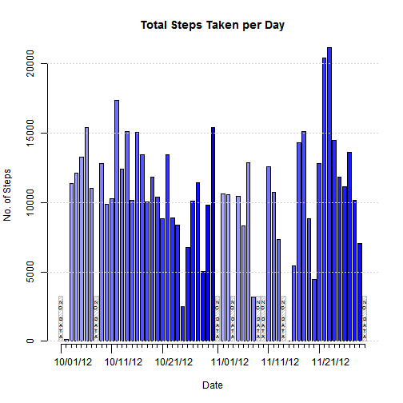
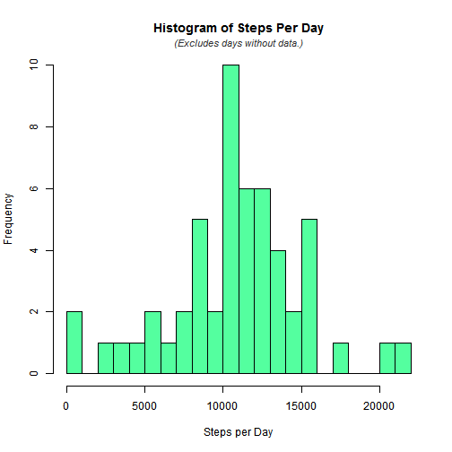
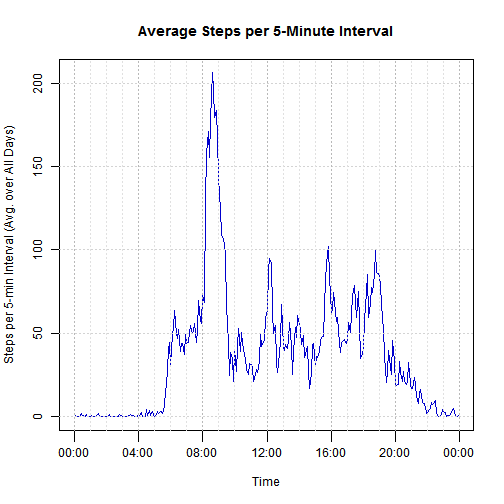
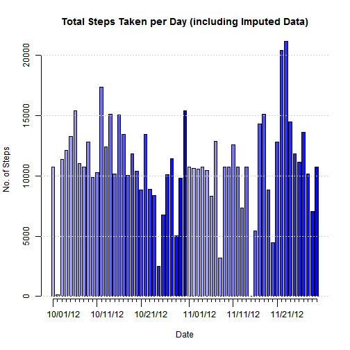
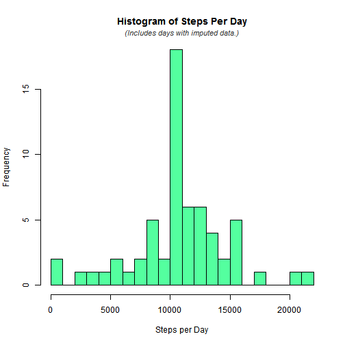
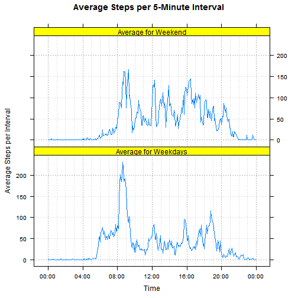

<br /><hr />
# Reproducible Research: Peer Assessment 1<hr />
<br />

This assignment uses a data set containing data recorded from a personal activity monitoring device. The data was downloaded from the [course web site](https://d396qusza40orc.cloudfront.net/repdata%2Fdata%2Factivity.zip). The data fields in the file are 
- "steps" (the number of steps taken in a 5-minute interval)
- "interval" (the time of the interval, in HM format -- no separator and no leading 0's)
- "date" (the date of the recording, in YYYY-MM-DD format)

Each 5-minute interval during the days recorded is represented by one line in the file. In some cases, the "steps" data is missing, as denoted in the file by "NA".


```r
opts_chunk$set(echo = TRUE, results = "hide", tidy = FALSE)
```

<br />  
<br />  

## Loading and preprocessing the data<hr />
<p style="margin: 2.2em">

The data is read from the file and preprocessed prior to analyzing and plotting it. 


```r
# Times in the input file (column 'interval') are given in hours 
# and minutes in an odd format: there is no separator and leading
# 0's are omitted. This makes it a nuisance to manipulate them. 
# To correct that, create a new "as" function to add leading 0's
# to the interval values so they can be more easily converted to 
# a time type. This function probably should check for NA values,
# but there are no NA intervals in the assignment file, so that 
# check will be omitted for now. By making this an "as" function,
# it can be applied when the data is read from the file.
      
setClass("paddedHM")
setAs("character", "paddedHM", 
      function(from) sprintf("%04d", as.numeric(from)))
 
# Read the data from the file. Add a new column for a combined
# date/time value in POSIXlt type.
 
steps = read.csv("activity.csv",  
                 colClasses=c("integer", "character", "paddedHM"))
              
steps$dateTime = 
    strptime(paste(steps$date, steps$interval), "%Y-%m-%d %H%M")

# Create two data frames, each containing the total number of steps 
# for each day. In the first frame, days with no step data are 
# included. In the second frame, they are not included. 

stepsByDay = 
    aggregate(steps$steps, by=list(steps$date), FUN=sum, na.rm=TRUE)
names(stepsByDay) = c("date", "steps")
stepsByDay$date = as.POSIXlt(stepsByDay$date)

stepsByDayNoNA = 
    aggregate(steps$steps ~ steps$date, FUN=sum, na.rm=TRUE)
names(stepsByDayNoNA) = c("date", "steps")
stepsByDayNoNA$date = as.POSIXlt(stepsByDayNoNA$date)

# Create a data frame containing the number of steps taken in each
# interval, averaged over all days in the data set. 

stepsByTime = 
    aggregate(steps$steps, by=list(steps$interval), FUN=mean, na.rm=TRUE)
names(stepsByTime) = c("time", "steps")
stepsByTime$time = as.POSIXlt(stepsByTime$time, format="%H%M")

# Set up some variables to help make the plots pretty.

# Limit tick labeling to reduce crowding:  
ticksToLabel = stepsByDay$date$mday %in% c(1, 11, 21)

# Create a color gradient within each month to enhance readability:
monthPalette = colorRampPalette(c("#B0B0FF", "blue"), space="rgb")(31)
barColors = monthPalette[stepsByDay$date$mday]

# Identify the dates that have no data:
NADates = !(stepsByDay$date %in% stepsByDayNoNA$date)
noDataString = paste(unlist(strsplit("NO DATA","")), collapse="\n")

# Define tick locations and labels:
everyHour = seq(as.POSIXct(stepsByTime$time[1]), 
                as.POSIXct(stepsByTime$time[1]) + 24*3600, 3600)
every4thHour = everyHour[(as.POSIXlt(everyHour)$hour %% 4) == 0]
every4thHourLabel = as.character(every4thHour, "%H:%M")
```

<br />  
<br />  
  
## What is mean total number of steps taken per day?<hr />
<p style="margin: 2.2em">

It is informative (but not required by the assignment) to plot the total steps for each day:


```r
# Create a bar plot of the total number of steps each day. This
# plot includes the "no data" days.

bp = barplot(stepsByDay$steps, col=barColors, space=0.4,   
             main="Total Steps Taken per Day",   
             xlab="Date", ylab="No. of Steps") 
axis(1, at=bp, tcl=-0.25, labels=rep("", nrow(stepsByDay)))
axis(1, at=bp[ticksToLabel], tcl=-0.75, hadj=0.2,  
     labels=as.character(stepsByDay$date[ticksToLabel], "%m/%d/%y"))
suppressWarnings(rect(bp[NADates] - 0.65, 0, bp[NADates] + 0.5, 3250,  
                      density=30, col="grey", box="grey"))
text(bp[NADates], 0, noDataString, cex=0.5, pos=3, offset=0.3)
grid(nx=NA, ny=NULL)
```

 


Another informative way to view the data is with a histogram of the number of steps per day (excluding days for which data is not available):


```r
# Create a histogram of the steps-per-day distribution (without 
# the "no data" days. 

breakCount = 25
hist(stepsByDayNoNA$steps, breaks=breakCount, col="seagreen1",   
     main="Histogram of Steps Per Day", xlab="Steps per Day")
mtext("(Excludes days without data.)",   
      col="grey20", cex=0.9, font=3, line=0.3)
```

 


The number of breaks (25) was chosen somewhat arbitrarily, with the goal of being informative but not excessively detailed.

Statistics were computed from the recorded data. The computations exclude days for which data was not recorded. 


```r
# Compute statistics for the steps per day (excluding days with  
# no data).

stepsStats = summary(stepsByDayNoNA$steps, digits=5)
meanStepsPerDay = stepsStats["Mean"]
medianStepsPerDay = stepsStats["Median"]
```


- Mean total steps per day:&nbsp;&nbsp;&nbsp;&nbsp;&nbsp;**10766**
- Median total steps per day:&nbsp;&nbsp;**10765**
<br />  
<br />  
  
## What is the average daily activity pattern?<hr />
<p style="margin: 2.2em"> 

The number of steps during each time interval of an average day (averaged over all days for which data is available) is shown in this time-series plot:


```r
# Plot the average steps per interval versus time.

plot(stepsByTime, type="l", xaxt="n", col="mediumblue",  
     main="Average Steps per 5-Minute Interval",  
     xlab="Time", ylab="Steps per 5-min Interval (Avg. over All Days)")

axis(1, at=every4thHour, tcl=-0.75, labels=every4thHourLabel)

grid(nx=NA, ny=NULL)
abline(v=everyHour, col="gray88", lty="dotted") 
abline(v=every4thHour, col="grey72", lty="dotted") 
```

 

```r

# Find the interval with the highest activity (most steps).

maxAvgStepsPerInterval = max(stepsByTime$steps)
mostActiveTime =  
    stepsByTime[stepsByTime$steps == maxAvgStepsPerInterval,]$time                          
mostActiveTime = as.character(mostActiveTime, "%H:%M")                         
```


From the average interval data the 5-minute interval with the maximum average activity can be determined. 

Time of maximum average activity:&nbsp;&nbsp;**08:35**.  
<br />  
<br />  
  
## Imputing missing values<hr />
<p style="margin: 2.2em">

One option for handling NA values is to impute, or estimate, what the missing values would have been. For this assignment, the chosen strategy for imputing the missing values is to use the value for the corresponding time interval averaged over the days for which data is available. A new data set was created by replacing NA's in the original data set with these imputed values.


```r
# Impute the missing step counts in the original data set by using   
# the average for the corresponding interval. Fill the missing  
# values with the imputed values to create a new data set.  
# Note: All missing data is in the 'steps' field. The date and  
# interval fields are complete.

missingDataCount = nrow(steps) - sum(complete.cases(steps[,"steps"]))

replacement = data.frame(steps=stepsByTime$steps,  
                         row.names=as.character(stepsByTime$time, "%H%M"))

stepsImputed = steps
stepsImputed$steps = ifelse(is.na(stepsImputed$steps),  
                            replacement[stepsImputed$interval, "steps"],  
                            stepsImputed$steps)
           
# Now repeat the "per day" computations and plotting previously  
# done for the original data.

stepsByDayImputed = aggregate(stepsImputed$steps, 
                              by=list(stepsImputed$date),  
                              FUN=sum, na.rm=TRUE)
names(stepsByDayImputed) = c("date", "steps")

stepsByDayImputed$date = as.POSIXlt(stepsByDayImputed$date)
```


The number of data points with missing (NA) data is&nbsp;&nbsp;**2304**.  

The total steps for each day -- with imputed values included -- are shown in this plot:


```r
# Create a bar plot of the total number of steps each day.

bp = barplot(stepsByDayImputed$steps, col=barColors, space=0.4,  
             main="Total Steps Taken per Day (including Imputed Data)",  
             xlab="Date", ylab="No. of Steps") 
axis(1, at=bp, tcl=-0.25, labels=rep("", nrow(stepsByDayImputed)))
axis(1, at=bp[ticksToLabel], tcl=-0.75, hadj=0.2,  
     labels=as.character(stepsByDayImputed$date[ticksToLabel], "%m/%d/%y"))
grid(nx=NA, ny=NULL)
```

 


The histogram of the number of steps per day (including days for which data is imputed) is shown here:


```r
# Create a histogram of the steps-per-day distribution. 

hist(stepsByDayImputed$steps, breaks=25, col="seagreen1",   
     main="Histogram of Steps Per Day", xlab="Steps per Day")
mtext("(Includes days with imputed data.)", col="grey20", cex=0.9, font=3, line=0.3)
```

 


The large spike in the middle of this histogram is due to the fact that the  same imputed values were used for all eight "no data" days.  

Statistics were computed for the new data set. 


```r
# Compute statistics for the steps per day.

stepsStatsImputed = summary(stepsByDayImputed$steps, digits=5)
meanStepsPerDayImputed = stepsStatsImputed["Mean"]
medianStepsPerDayImputed = stepsStatsImputed["Median"]
```


- Mean total steps per day:&nbsp;&nbsp;&nbsp;&nbsp;&nbsp;**10766**
- Median total steps per day:&nbsp;&nbsp;**10766**

The mean is the same as for the original data, which is to be expected given the strategy of imputing by using average values. The median, on the other hand, is different. When looking at the sorted daily averages, the imputed daily averages occupy a range in the middle of the existing daily averages (as can be seen by comparing the two histograms). Thus, it's not surprising that the old median has been nudged out and the new median falls within the block of imputed daily averages.  
<br />  
<br />  
  
## Are there differences in activity patterns between weekdays and weekends?<hr />
<p style="margin: 2.2em">

The final part of the analysis consists of looking at the difference in activity patterns over weekends versus the patterns over weekdays. This difference can be seen in the following time-series plot:


```r
# Factor the imputed data by weekend versus weekday.

dayToWeekPart = c("Sun"="weekend", "Mon"="weekday", "Tue"="weekday",  
                  "Wed"="weekday", "Thu"="weekday", "Fri"="weekday",  
                  "Sat"="weekend")

stepsImputed$weekPart =   
    as.factor(dayToWeekPart[weekdays(stepsImputed$dateTime,   
                        abbreviate=TRUE)])
                        
# Create a data frame with the number of steps taken in each  
# interval, averaged over all days in the data set, including the   
# imputed data, and grouped by weekend versus weekday.

stepsByTimeImputed =   
    aggregate(stepsImputed$steps,  
              by=list(stepsImputed$interval, stepsImputed$weekPart),  
              FUN=mean, na.rm=TRUE)
names(stepsByTimeImputed) = c("time", "weekPart", "steps")
stepsByTimeImputed$time =  
    as.POSIXlt(stepsByTimeImputed$time, format="%H%M")

# Plot the average step data versus time, broken down by weekend vs  
# weekday.

library(lattice)
      
gridColors=c("gray72",rep("gray88",3))

print(
with(stepsByTimeImputed,  
     { xyplot(steps ~ as.POSIXct(time) | weekPart, layout=c(1,2),  
              type="l", main="Average Steps per 5-Minute Interval",  
              xlab="Time", ylab="Average Steps per Interval",  
              scales=list(x=list(at=every4thHour,  
                                 labels=every4thHourLabel)),  
              strip=strip.custom(factor.levels=c("Average for Weekdays",  
                                                 "Average for Weekend"),  
                                 bg="yellow"),  
              abline=list(v=everyHour, h=seq(0, 200, 50),   
                          col=gridColors, lty="dotted")  
             )  
     })  
)
```

 


The weekend activity appears more sustained throughout the day. Weekday activity has a larger morning spike with lower activity the remainder of the day. Activity tapers off earlier in the evening on weekdays and starts earlier in the morning.  
<br />  
<hr />
<br />
  
